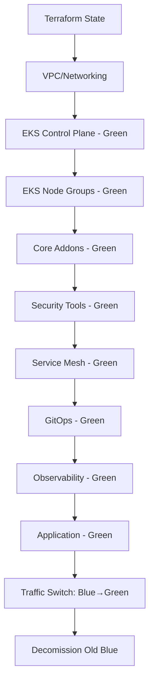

"# Upgradeability Strategy

> **Documentation of the upgrade strategy for the enterprise EKS platform, ensuring safe, zero-downtime upgrades across all components.**

## Overview

This document defines the upgrade strategy for the Enterprise-Grade AWS EKS Platform. The platform must support safe upgrades for every component while minimizing downtime and operational risk. The Blue/Green cluster architecture is the cornerstone of this strategy.

## Upgrade Philosophy

### Principles

1. **Zero-Downtime:** Upgrades must not impact production workloads
2. **Rollback Always:** Every upgrade must be reversible
3. **Test Before Production:** Validate upgrades in lower environments first
4. **Automated:** Minimize manual intervention
5. **Observable:** Monitor upgrade progress with clear metrics
6. **Documented:** Every upgrade procedure must be documented

### Blue/Green Upgrade Pattern

```
Normal State:
┌─────────────┐     ┌─────────────┐
│ Blue Cluster│◄────│  Route53    │◄──── Users
│  (Active)   │     │  (100%)     │
└─────────────┘     └─────────────┘
┌─────────────┐
│Green Cluster│
│  (Standby)  │
└─────────────┘

During Upgrade:
┌─────────────┐     ┌─────────────┐
│ Blue Cluster│     │  Route53    │◄──── Users
│  (Old Ver)  │     │  (100%)     │
└─────────────┘     └─────────────┘
┌─────────────┐
│Green Cluster│
│  (New Ver)  │◄──── Validation
└─────────────┘

After Upgrade:
┌─────────────┐     ┌─────────────┐
│Blue Cluster │     │  Route53    │◄──── Users
│  (Standby)  │     │  (100%)     │
└─────────────┘     └─────────────┘
┌─────────────┐
│Green Cluster│
│  (New Ver)  │◄──── Active
└─────────────┘
```

## Component Upgrade Strategy

### 1. EKS Cluster Version Upgrades

| Component | Strategy | Downtime | Rollback |
|-----------|----------|----------|----------|
| Control Plane | Blue/Green cluster switch | None | Traffic switch back |
| Node Groups | Rolling update | None (PDB required) | Revert AMI version |
| Addons | Canary rollout | None | Version rollback |

#### Procedure: EKS Version Upgrade

```bash
# 1. Deploy Green cluster with new EKS version
terraform apply -target=module.eks_green

# 2. Validate Green cluster
kubectl --context=green-cluster get nodes
kubectl --context=green-cluster get pods --all-namespaces

# 3. Deploy applications to Green cluster
kubectl --context=green-cluster apply -f kubernetes/

# 4. Route test traffic to Green cluster
aws route53 change-resource-record-sets \
  --hosted-zone-id $ZONE_ID \
  --change-batch '{
    "Changes": [{
      "Action": "UPSERT",
      "ResourceRecordSet": {
        "Name": "green.test.eks.example.com",
        "Type": "A",
        "SetIdentifier": "green-cluster",
        "Weight": 10,
        "AliasTarget": {
          "HostedZoneId": "$ALB_ZONE_ID",
          "DNSName": "$GREEN_ALB_DNS",
          "EvaluateTargetHealth": true
        }
      }
    }]
  }'

# 5. Gradually shift traffic
#    - Start: Blue 100%, Green 0%
#    - Test:  Blue 90%,  Green 10%
#    - Half:  Blue 50%,  Green 50%
#    - Complete: Blue 0%, Green 100%

# 6. Validate after full switch
kubectl --context=green-cluster get pods --all-namespaces
```

### 2. Terraform Module Upgrades

| Strategy | Description | When to Use |
|----------|-------------|-------------|
| **Version Pinning** | Pin module versions in Terraform | All modules |
| **Terraform Plan Review** | Review `terraform plan` output | Every change |
| **State Rollback** | Use S3 versioning for state rollback | Failed applies |
| **Environment Isolation** | Test in dev before prod | Every change |

#### Version Pinning Strategy

```hcl
# terraform/modules/vpc/main.tf
terraform {
  required_version = "~> 1.5.0"
}

# Pin module source versions
module "vpc" {
  source = "terraform-aws-modules/vpc/aws"
  version = "~> 5.0"  # Pinned minor version
  # ... configuration ...
}
```

### 3. Kubernetes Addon Upgrades

| Addon | Upgrade Strategy | Validation |
|-------|-----------------|------------|
| CoreDNS | Rolling update | DNS resolution tests |
| kube-proxy | Rolling update | Network connectivity tests |
| VPC CNI | Rolling update | Pod networking tests |
| EBS CSI Driver | Rolling update | Volume operations tests |

#### Addon Upgrade Procedure

```bash
# 1. Check current addon version
aws eks describe-addon \
  --cluster-name eks-blue-dev \
  --addon-name vpc-cni

# 2. Upgrade addon
aws eks update-addon \
  --cluster-name eks-blue-dev \
  --addon-name vpc-cni \
  --addon-version v1.16.0-eksbuild.1 \
  --resolve-conflicts OVERWRITE

# 3. Validate addon
kubectl --context=blue-cluster get pods -n kube-system -l k8s-app=aws-node
kubectl --context=blue-cluster rollout status daemonset aws-node -n kube-system
```

### 4. Helm Chart Upgrades

| Strategy | Description | Risks |
|----------|-------------|-------|
| **Rolling Upgrade** | Default Helm upgrade | API breaking changes |
| **Blue/Green** | Install new version alongside | Double resource usage |
| **Canary** | Gradual traffic shift | Complexity |

#### Helm Upgrade Command

```bash
# Pre-upgrade: Backup current values
helm get values <release> -n <namespace> > values-backup.yaml

# Upgrade with history
helm upgrade <release> <chart> \
  --namespace <namespace> \
  --values values.yaml \
  --history-max 5 \
  --atomic \
  --timeout 10m \
  --wait

# Rollback if needed
helm rollback <release> <revision> -n <namespace>
```

### 5. Istio Upgrades

| Component | Strategy | Notes |
|-----------|----------|-------|
| **Control Plane** | Canary (revision-based) | Install new revision, migrate |
| **Data Plane** | Rolling restart | Sidecar proxy updates |

#### Istio Revision-Based Upgrade

```yaml
# 1. Install new control plane revision
apiVersion: install.istio.io/v1alpha1
kind: IstioOperator
metadata:
  namespace: istio-system
  name: istio-canary
spec:
  revision: canary
  profile: default
  components:
    pilot:
      k8s:
        overlays:
          - apiVersion: apps/v1
            kind: Deployment
            name: istiod
            patches:
              - path: spec.template.metadata.labels
                value:
                  istio.io/rev: canary
```

### 6. ArgoCD Upgrades

| Strategy | Description |
|----------|-------------|
| **Rolling Upgrade** | Standard Helm upgrade with blue/green ArgoCD instances |
| **Dual Installation** | Run old + new alongside, migrate applications |

#### ArgoCD Upgrade

```bash
# 1. Backup ArgoCD configuration
kubectl get applications -n argocd -o yaml > argocd-apps-backup.yaml
kubectl get applicationset -n argocd -o yaml > argocd-appsets-backup.yaml

# 2. Upgrade ArgoCD via Helm
helm upgrade argocd argo/argo-cd \
  --namespace argocd \
  --version 5.46.0 \
  --values values.yaml \
  --atomic

# 3. Verify ArgoCD health
kubectl get pods -n argocd
argocd version --client
argocd repo list
```

### 7. Observability Stack Upgrades

| Component | Strategy | Validation After Upgrade |
|-----------|----------|------------------------|
| **Prometheus** | Rolling (StatefulSet) | Query metrics |
| **Grafana** | Rolling (Deployment) | Dashboards load |
| **Loki** | Rolling (StatefulSet) | Log queries work |
| **Tempo** | Rolling (StatefulSet) | Trace queries work |

### 8. Security Tool Upgrades

| Tool | Strategy | Breaking Changes |
|------|----------|------------------|
| **Kyverno** | Rolling upgrade | Policy API changes |
| **Falco** | DaemonSet rolling update | Rule format changes |
| **External Secrets** | Helm upgrade | Provider API changes |

## Upgrade Sequencing

### Dependency Chain

```
Higher Priority (Upgrade First):
1. Terraform state backend (bootstrap)
2. VPC/Networking (shared foundation)
3. EKS Control Plane (foundation)
4. EKS Node Groups (compute)
5. Core Addons (VPC CNI, CoreDNS, kube-proxy)
6. Storage (EBS CSI Driver)
7. Security Tools (Kyverno, Falco, External Secrets)
8. Service Mesh (Istio)
9. GitOps (ArgoCD)

Lower Priority (Upgrade Later):
10. Observability Stack
11. Application Workloads
12. CI/CD Pipelines
```

### Upgrade Sequence Example



## Rollback Procedures

### Immediate Rollback

```bash
# Terraform State Rollback
aws s3api get-object-version \
  --bucket enterprise-eks-platform-tfstate-$ACCOUNT_ID-$REGION \
  --key dev/terraform.tfstate \
  --version-id $PREVIOUS_VERSION \
  dev/terraform.tfstate.previous

# Traffic Rollback
aws route53 change-resource-record-sets \
  --hosted-zone-id $ZONE_ID \
  --change-batch '{
    "Changes": [{
      "Action": "UPSERT",
      "ResourceRecordSet": {
        "Name": "api.eks.example.com",
        "Type": "A",
        "SetIdentifier": "blue-cluster",
        "Weight": 100,
        "AliasTarget": {
          "HostedZoneId": "$BLUE_ALB_ZONE_ID",
          "DNSName": "$BLUE_ALB_DNS",
          "EvaluateTargetHealth": true
        }
      }
    }]
  }'

# Helm Rollback
helm rollback <release> <revision> -n <namespace>
```

### Failed Upgrade Recovery

1. **Identify failure:** Check deployment status, logs, events
2. **Stop upgrade:** Halt any in-progress operations
3. **Assess damage:** Determine what changed
4. **Revert:** Use rollback procedures above
5. **Root cause analysis:** Document failure
6. **Retry:** Apply fixes and try again

## Validation After Upgrades

### Checklist

- [ ] All pods running and healthy
- [ ] DNS resolution working
- [ ] Network connectivity verified
- [ ] Storage operations working
- [ ] Security policies enforced
- [ ] Service mesh mTLS active
- [ ] ArgoCD synced and healthy
- [ ] Metrics and logs being collected
- [ ] Traces being captured
- [ ] Cost metrics within expected range

## Common Upgrade Risks

| Risk | Mitigation |
|------|------------|
| **API Breaking Changes** | Test in dev first, review release notes |
| **Version Skew** | Follow version upgrade path, don't skip versions |
| **Data Migration** | Backup before upgrade, test restore procedure |
| **Configuration Drift** | GitOps reconciliation should fix drift |
| **Dependency Conflicts** | Pin versions, use compatibility matrices |

## Next Steps

1. Document upgrade procedures for each component
2. Create upgrade runbooks for common scenarios
3. Implement automated upgrade validation tests
4. Schedule regular upgrade rehearsals
5. Review and update this document quarterly"